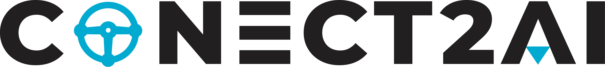

&nbsp;
&nbsp;

  

# Multi-Agent Orchestration for Knowledge Continuity in Legacy Industrial Automation

# Authors
- [Matheus Andrade](https://scholar.google.com/citations?user=wQhsVBcAAAAJ&hl=pt-BR&oi=ao)
- [Marianne Silva](https://scholar.google.com/citations?user=kxJvTTUAAAAJ&hl=pt-BR)
- [Dennis Brandão](https://scholar.google.com/citations?user=OxSKwvEAAAAJ&hl=pt-BR)
- [Paolo Ferrari](https://scholar.google.com/citations?user=-BIQbXMAAAAJ&hl=it)
- [Ivanovitch Silva](https://scholar.google.com/citations?user=aa5xs_0AAAAJ&hl=pt-BR)

## 📚 Overview

This repository contains the source code and experimental framework for the study: "A Multi-Agent Generative AI Architecture for Knowledge Continuity in Legacy Industrial Automation Systems".

In legacy industrial environments, critical engineering expertise is often trapped in thousands of pages of unstructured technical documentation, making diagnostics and maintenance challenging. This project addresses this by investigating Generative AI as an enabling technology for knowledge continuity, using the PROFIBUS protocol as a representative case study.

#### Key Contributions:

- Multi-Agent RAG Architecture: A specialized orchestration system using a Supervisor-Worker pattern to manage complex industrial queries.
- High Reliability: Achieves approximately 80% faithfulness to technical documentation, significantly reducing hallucinations compared to standard LLMs.
- Sustainability Awareness: Includes an analysis of $CO_{2}$ emissions and computational costs, highlighting the trade-off between reliability and efficiency.
- Context-Aware Evaluation: Implements the LLM-as-a-Judge methodology alongside human expert validation for robust accuracy assessment.

## 🏗️ Architecture

The system is built on four main pillars:
- Data Acquisition: Processing 20 technical standards into specialized vector stores for "Developer" and "Engineer" profiles.
- Agentic Orchestration: A Supervisor Agent routes queries to specialized Worker Agents (Developer or Engineer) based on intent.
- Reasoning Engine: Powered by Gemma 3 (27B) via the LangGraph library for iterative information processing.
- Embedding Pipeline: Utilizing mxbai-embed-large and FAISS for high-precision semantic retrieval.

## 🌎 About Conect2AI

The research group [**Conect2AI**](http://conect2ai.dca.ufrn.br) is composed of undergraduate and graduate students from the Federal University of Rio Grande do Norte (UFRN). Its focus is on the application of Artificial Intelligence (AI) and Machine Learning (ML) to emerging areas.

- **Embedded Intelligence and IoT**: Development of solutions aimed at optimizing resource management and energy consumption in connected environments.
- **Energy Transition and Mobility**: Application of AI to improve the energy efficiency of connected vehicles and to promote more sustainable mobility.
